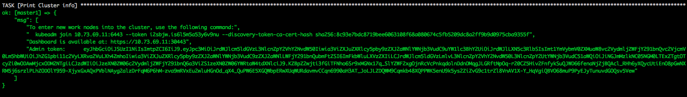

# Развертывание High Available Kubernetes кластера 

Данный playbook разварачивает HA кластер Kubernetes.
При развертывании можно выбрать следующие параметры
-  Выбрать CRI - docker или containerd
- Выбрать развертывание с использованием nginx как loadbalancer API сервера
- Выбрать используемый CIDR


## Последовательность развертывания:
- на машине, с которой запускается плейбук, создается временный каталог /tmp/k8s. Он понадобится для копирования сертификатов после инициализации первого мастера. Также в него будет добавлена строка инициализации сгенерированная kubeadmin
- на мастерах и рабочих нодах устанавливается kubelet, kubectl, kubeadm
- на мастерах и рабочих нодах установливается CRI. Containerd или Docker (переменная criType в файле hosts. Может принимать значения docker или containerd)
- устанавливается ETCD. Настраивается ETCD кластер
- устанавливается и настраивается keepalived
- устанавливается и настраивается nginx, для балансировки между API серверами kubernetes на всех мастерах (переменная apiLoadBalancer в файле hosts. Может принимать значения true или подробности ниже)
- на master1 при помощи kubeadm init создаем первый мастер кластера сертификаты, ключи и.т.д.
- с помощью сгенерированых файлов конфигурации в кластер добавляются master2 и master3.
- устанавливается CIDR (сейчас только flanel)
- Делается scale coredns на все три мастера
- конфигурируем балансировщик nginx на каждой мастер ноде для виртуального адреса
- если использем балансировщик nginx: меняем адрес и порт API сервера на выделенный виртуальный адрес
- добавляются в кластер рабочие ноды

## Быстрый старт:

```bash
git clone https://github.com/rjeka/k8s-easy-ha-cluster.git
cd k8s-easy-ha-cluster
vim hosts
```
В файле hosts:
- в группе хостов [masters] изменить значения ansible_host на IP адреса мастеров.  
  keepalivedInterface - поменять на значение интерфейса, на котором будет работать API сервер kubernetes. На этом же       интерфейсе keepalived создаст subinterface c виртуальным IP
- в группе хостов [worknodes]  изменить значения ansible_host на IP адреса рабочих нод
- в группе хостов [ingressnodes] добавить имена и ip нод для ingress контроллера
- в блоке [all:vars]:
  - virtIp - виртуальный IP адрес keepalived
  - apiLoadBalancer=true если вы хотите использовать схему с балансировкой API. (false - без балансировки)
  - ingressHA. Если true, то ingress контроллер создается на отдельных ingress нодах (описать в группе [ingressnodes])
  - criType. containerd или docker, в зависимости какой CRI вы хотите использовать
  - если используется containerd criContainersVersion=1.1.0-rc.0 (now stable 1.1.0-rc.0). Если docker то можно ничего не менять
  - helm если хотите установить в кластер helm то true, если helm не нужен то false
  - DynamicKubeletConfig - в версии kubernetes 1.11 появилась возможность динамического обновления конфигурации, если нужна то true, если нет то false
  - garbageCollection - сборщик мусора, если true то с master1 удялятся скаченные архивы CRI и ETCD, все не нужные конфиг файлы,  останется только строка сгенерированная kubeadm в файле /opt/config/token.txt. Если false то все архивы и конфиги останутся
- [masters:vars]
  - СIDR=192.168.0.0/16 для установки callica
  - K8SHA_TOKEN токен для kubeadmin. Можно сгенерировать kubeadm token generate
  - etcd_version=v3.2.17 
  - etcdToken - токен etcd любое значение например 9489bf67bdfe1b4ae067d6fd9e7efefd
  - kepalivedPass - праоль keepalived любое значение например 6cf8dd754c90194d1600c483e10abfr
 
```bash
ansible-playbook -i hosts main.yaml
```
После того как плейбук отработает, на экран будет выведенна информация о кластере


## Схема балансировки API:
При разворачивании кластера используется keepalived — реализация протокола VRRP (Virtual Router Redundancy Protocol) для Linux.  
Keepalived создает виртуальный IP (VIRTIP) который "указывает" (создает subinterface) на IP одного из трех мастеров. Демон keepalived следит за работоспособностью машин и в случае обнаружения сбоя — исключает сбойный сервер из списка активных серверов, переключая VIRTIP на IP другого сервера, согласно "весу", указанному при настройке keepalived на каждом сервере.

Демоны keepalived общаются по протоколу VRRP, посылая друг другу сообщения на адрес 224.0.0.18.

Если сосед не прислал свое сообщение, то по истечению периода он считается умершим. Как только упавший сервер начинает слать свои сообщения в сеть, все возвращается на свои места

Работу с API сервером на нодах kubernetes мы настраиваем следующим образом.  
После установки кластера настраиваем kube-proxy, меняем порт с 6443 на 16443.  
На каждом из мастеров развернут nginx, который работает как loadbalancer, слушает порт 16443 и делает upstream по всем трем мастерам на порт 6443 (подробности ниже).

Данной схемой достигнута повышенная отказоустойчивость c помощью keepalived, а так же с помощью nginx достигнута балансировка между API серверами на мастерах.<br/>


